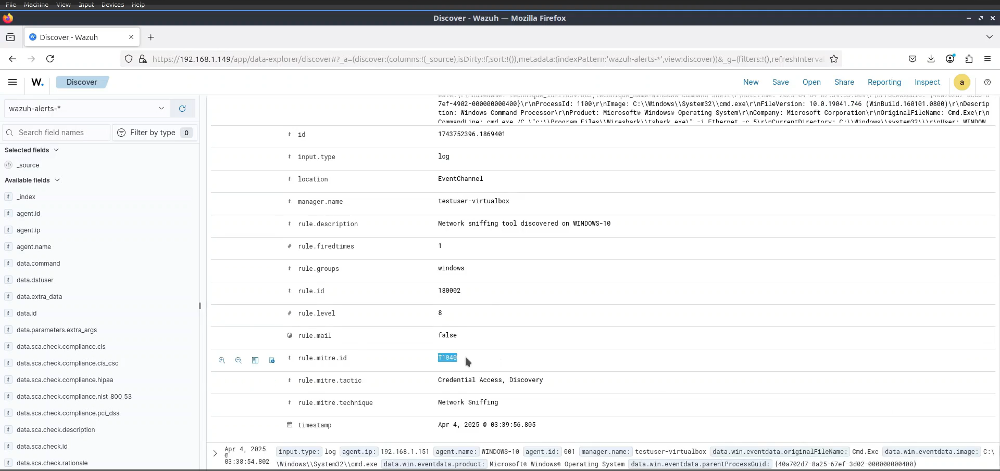

# **Adversary Emulation with Wazuh and Caldera**

## **Introduction**
Adversary emulation is a cybersecurity technique used to simulate real-world cyber threats to assess an organization's defenses. This project involves **Wazuh**, an open-source security platform, and **Caldera**, a powerful adversary emulation framework, to simulate attacks and analyze security responses.

## **Objectives**
- Emulate real-world adversary tactics using **Caldera**.
- Monitor and analyze attack behaviors with **Wazuh**.
- Strengthen security defenses by understanding Indicators of Compromise (IOCs).

## **Techniques**

1. Linux endpoint

T1136.001 - Create Account: Local Account
T1531 - Account Access Removal
T1053.003 - Scheduled Task/Job: Cron

2. Windows endpoint

T1197 - BITS Jobs
T1040 - Network Sniffing
T1021.001 - Remote Services: Remote Desktop Protocol

## **1. Setting Up the Environment**

### Install Caldera
Caldera is used to simulate adversary tactics.

Requirements:

- Linux or macOS operating system
- Python 3.7+ (with pip3)
- Hardware: 8GB+ RAM and 2+ CPUs

1. Clone and install dependencies:

git clone https://github.com/mitre/caldera.git
cd caldera
pip3 install -r requirements.txt

2. Start the CALDERA server:

python3 server.py --insecure

3. Navigate to http://localhost:8888 using the default credentials red/admin

### Install Wazuh
Wazuh provides threat detection, log analysis, and intrusion monitoring.

1. Install Wazuh Server

curl -sO https://packages.wazuh.com/4.11/wazuh-install.sh && sudo bash ./wazuh-install.sh -a

2. Deploy Wazuh Agent on target systems

- Install and enroll the Wazuh agent on the Linux sandbox.
- Install and enroll the Wazuh agent on the Windows sandbox.

3. Verify integration with Wazuh Dashboard.

### Install Sysmon on the Windows endpoint

For example: sysmon.exe -accepteula -i sysmonconfig.xml

## **2. Adversary Simulation with Caldera**

Connecting agents to CALDERA:

1. Navigate to the agents tab in CALDERA
2. Click on deploy an agent
3. Ensure that the app.contact.http option matches the CALDERA server URL
4. Change the agents.implant_name to caldera
5. Select the OS to be connected and copy the command

## Setup adversary profiles with MITRE techniques

1. Linux endpoint

- From the CALDERA server URL navigate to the adversary section and create an adversary profile
- Add the MITRE techniques using the Add Ability feature of CALDERA
- Click on Save Profile

2. Windows endpoint

- From the CALDERA server URL navigate to the adversary section and create an adversary profile
- Add the MITRE techniques using the Add Ability feature of CALDERA
- Click on Save Profile

## Run operations for the two adversarial profiles created

- Navigate to the operations section and create a new operation
- Add a new operation name and select either of the two adversary profiles
- Select Linux adversary profile for Linux endpoints and Windows adversary profile for Windows endpoints
- Click on start to run the attack

## Detection using Wazuh

1. Add a Custom rule to the /var/ossec/etc/rules/local_rules.xml file on the Wazuh server to detect these techniques on the Windows agent.

Rules:

<group name="windows">
   <rule id="180001" level="8" ignore="120">
      <if_group>windows</if_group>
      <match>bitsadmin.exe /transfer /Download /priority Foreground</match>
      <description>Suspicious download and execution with BITS job on $(win.system.computer)</description>
      <mitre>
         <id>T1197</id>
      </mitre>
   </rule>

   <rule id="180002" level="8" ignore="120">
      <if_group>windows</if_group>
      <match type="pcre2">(?i)(tshark|wireshark)</match>
      <description>Network sniffing tool discovered on $(win.system.computer)</description>
      <mitre>
         <id>T1040</id>
      </mitre>
   </rule>

   <rule id="180003" level="8" ignore="120">
      <if_group>windows</if_group>
      <field name="win.eventdata.commandline" type="pcre2" > reg add \\\"HKLM\\\\System\\\\CurrentControlSet\\\\Control\\\\Terminal Server\\\\WinStations\\\\RDP-Tcp\\\" /v PortNumber /t REG_DWORD *</field>
      <description>RDP port has been changed on $(win.system.computer)</description>
      <mitre>
         <id>T1021.001</id>
      </mitre>
   </rule>

</group>

2. Restart the Wazuh server

systemctl restart wazuh-manager

3. Finally, the emulated adversary techniques triggers alerts on the Wazuh dashboard

## **Conclusion**
This project provides hands-on experience in simulating cyber threats and monitoring responses. By integrating **Wazuh** with **Caldera**, cybersecurity professionals can gain valuable insights into adversary behaviors and strengthen defense strategies.

## *Walkthrough | Screenshots*

**CALDERA Installation**

      

**WAZUH Installation**

    

**Wazuh Agent Enrollment**

  

**Sysmon Installation**

**Writing Custom Rules in Wazuh**

    

**Adversary Emulation in CALDERA**

           

**WAZUH Detection**

  
